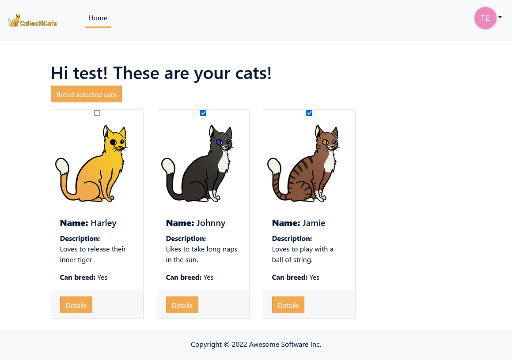
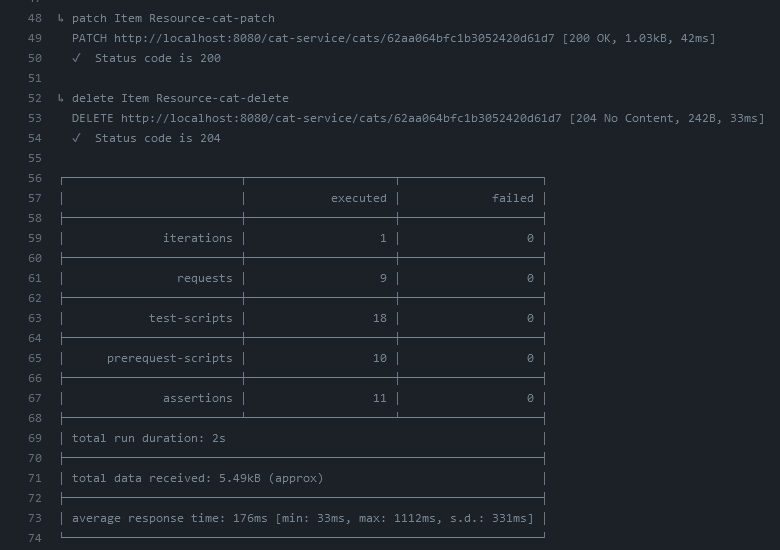
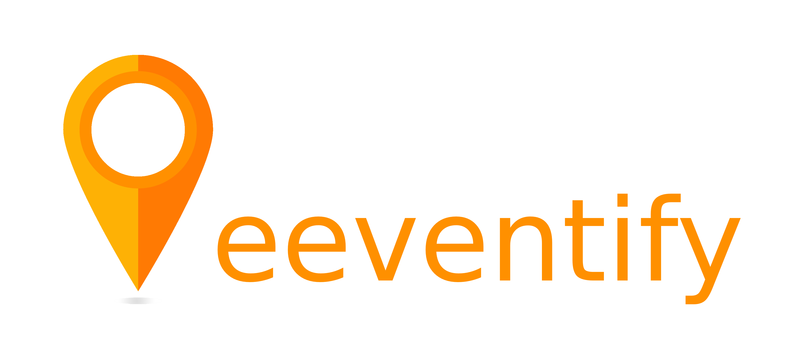

<!-- omit in toc -->
# Reader's Guide for Semester 3 Portfolio

Written by: Jeffrey E.G. Derksen  
For course: S-DB-IPS3 and S-DB-GPS3  
Class: S3-DB01  
Coaches: Bert Aarts, Samuil Angelov, Leon van Bokhorst, Timo Hermans, and Jean Paul Ligthart
Date: 19 June 2022  
Version: 4  

Portfolio for semester 3 of the bachelor's program of IT from Fontys University of Applied Sciences.

<!-- omit in toc -->
## Version control

| Version | Changes |
|---------|---------|
| 1 | Initial version. |
| 2 | * Added [Learning Outcomes](#2-learning-outcomes) * Updated version of [Cultural Differences research](#31-cultural-differences) * Extended [section 4](#4-individual-project-collecticats): explanation choice for Java and learning process * Added [section 5.2](#52-cicd) about CI/CD within group project |
| 3 | * Added [Ethics Analysis](#32-ethics) * Added [Agile methods analysis](#33-agile-methods) * Added [section 4.2](#42-cicd) about CI/CD for individual project * Added [section 5.3](#53-software-quality) about software quality for group project |
| 4 | * Added [outsourcing research](#36-optimizing-for-outsourcing) * Added [security research](#35-security-risk-code-injection) * Added [reflection](#6-reflection) * Added IP [Software quality](#43-software-quality) * Improved IP [Software design](#41-software-design) * Improved IP [CI/CD](#42-cicd) |

<!-- omit in toc -->
## Table of contents

- [1. Introduction](#1-introduction)
- [2. Learning Outcomes](#2-learning-outcomes)
- [3. Research](#3-research)
  - [3.1. Cultural differences](#31-cultural-differences)
  - [3.2. Ethics](#32-ethics)
  - [3.3. Agile methods](#33-agile-methods)
  - [3.4. Business processes](#34-business-processes)
  - [3.5. Security Risk: Code Injection](#35-security-risk-code-injection)
  - [3.6. Optimizing for Outsourcing](#36-optimizing-for-outsourcing)
- [4. Individual Project (CollectiCats)](#4-individual-project-collecticats)
  - [4.1. Software design](#41-software-design)
  - [4.2. CI/CD](#42-cicd)
  - [4.3. Software Quality](#43-software-quality)
- [5. Group Project (Eeventify)](#5-group-project-eeventify)
  - [5.1. Software design](#51-software-design)
  - [5.2. CI/CD](#52-cicd)
  - [5.3. Software quality](#53-software-quality)
- [6. Reflection](#6-reflection)
  - [6.1. What I have learned](#61-what-i-have-learned)
  - [6.2. What went well](#62-what-went-well)
  - [6.3. Where there is room for improvement](#63-where-there-is-room-for-improvement)

## 1. Introduction

This document serves as the Reader's Guide for my semester 3 portfolio of the bachelor's program of Information Technology from Fontys University of Applied Sciences. The portfolio contains the products I have developed during the semester and with which I prove that I have gained sufficient knowledge to fulfil the requirements set in the learning outcomes. This guide provides a brief summary of each product and section, and points the reader towards the files which contain the fully worked-out versions of the subject.

This document is divided into six sections, including this introduction. In the second section, you will find a detailed description of each learning outcome and what knowledge is required to show your proficiency at it. In the third section, I have provided short descriptions for and links to each research report that I have written this semester. The fourth section is about my individual project, what it is about and how it has been designed and developed. In section five, you will find similar information about the group project, as well as my specific contributions to the project. And at the very end of this document you will come across section six, which contains my reflection on my learning process and experiences during the semester.

[⬆️ Back to Table of Contents](#table-of-contents)

## 2. Learning Outcomes

| # | Name | Short description | Clarification |
|---|------|-------------------|---------------|
| 1 | Web application | You design and build **user-friendly, full-stack** web applications. | **User friendly:** You apply basic User experience testing and development techniques. **Full-stack:** You design and build a full stack application using commonly accepted front end (JavaScript-based framework) and back end techniques (e.g. Object Relational Mapping) choosing and implementing relevant communication protocols and addressing asynchronous communication issues. |
| 2 | Software quality | You use software **tooling and methodology** that continuously monitors and improve the software quality during software development. | **Tooling and methodology:** Carry out, monitor and report on unit integration, regression and system tests, with attention for security and performance aspects, as well as applying static code analysis and code reviews. |
| 3 | Agile method | You **choose** and implement the most suitable agile software development method for your software project. | **Choose:** You are aware of the most popular agile methods and their underlying agile principles. Your choice of a method is motivated and based on well-defined selection criteria and context analyses. |
| 4 | CI/CD | You **implement** a (semi)automated software release process that matches the needs of the project context. | **Implement:** You implement a continuous integration and deployment solution (using e.g. Gitlab CI and Docker). |
| 5 | Cultural differences and ethics | You **recognize** and **take into account** cultural differences between project stakeholders and ethical aspects in software development. | **Recognize**:  Recognition is based on theoretically substantiated awareness of cultural differences and ethical aspects in software engineering. **Take into account:** Adapt your communication, working, and behavior styles to reflect project stakeholders from different cultures; Address one of the standard Programming Ethical Guidelines (e.g., ACM Code of Ethics and Professional Conduct) in your work. |
| 6 | Requirements and Design | You analyze (non-functional) requirements, elaborate (architectural) designs and validate them using **multiple types of test techniques**. | **Multiple types of test techniques:** You apply user acceptance testing and stakeholder feedback to validate the quality of the requirements. You evaluate the quality of the design (e.g., by testing or prototyping) taking into account the formulated quality properties like security and performance. |
| 7 | Business processes | You analyze and describe **simple** business processes that are **related** to your project. | **Simple:** Involving stakeholders, predominantly sequential processes with one or two alternative paths. **Related:** Business processes during which the software that you are developing will be used (business processes that the software must support by fully or partially automating them). **or** Business processes needed for the success of your software development project (e.g., product release, market release, financial assurance). |
| 8 | Professional | You act in a **professional manner** during software development and learning. | **Professional manner:** You develop software as a team effort according to a prescribed software methodology and following team agreements. You are able to track your work progress and communicate your progress with the team. You actively ask and apply feedback from stakeholders and advise them on the most optimal technical and design (architectural) solutions. You choose and substantiate solutions for a given problem. |

[⬆️ Back to Table of Contents](#table-of-contents)

## 3. Research

During the course of this semester, I have performed a lot of research into new technologies, business processes and methods, cultural differences and ethics, security risks and prevention methods, and the importance of well documented projects. I have worked out some of this research into research reports, which you can find below. Being knowledgeable about these different subjects as well as able to perform research on new ones, helps demonstrate my proficiency at learning outcome 8: Professional.

### 3.1. Cultural differences

For the subject of cultural differences I have done some research about what culture is and what are well-known dimensions on cultural differences. I have also written about my personal experiences with cultural differences. This product helps prove my proficiency at learning outcome 5: Cultural differences and ethics.  
[📄 View file](/research/cultural_differences.md)

### 3.2. Ethics

As a software engineer you need to be aware of the different ethical aspects, principles, and practices within the field. You should ensure that your software meets accessibility standards, that it respects a user's privacy, and that it is secure, amongst other things. In order to achieve this you have to critically evaluate your software design in all stages of its development, starting off with an ethically sound design and adjust it when necessary. I have done research on this subject and performed an ethical analysis of my group project and individual project in order to increase my proficiency at learning outcome 5: Cultural differences and ethics.  
[📄 View file](/research/ethics_analysis.md)

### 3.3. Agile methods

Software development is often supported by Agile practices. During this semester I have used an Agile method called Scrum for my individual project and my group project. But there are many other Agile methods available to use and each has their own use cases and benefits. I have performed some research into the definition of Agile, the different methods that are available, and how it is used in practice. This product helps prove my proficiency at learning outcome 3: Agile method.  
[📄 View file](/research/agile_methods.md)

### 3.4. Business processes

Placeholder

### 3.5. Security Risk: Code Injection

When you develop and publish a web application, you are exposing it to a potentially harmful environment. There are those who prowl the internet looking for security vulnerabilities to exploit and cause damage or steal sensitive data. Naturally, when developing a web application you would want to make sure that your application contains as few as possible security vulnerabilities—preferably none at all! In this research report, I have done research into the security risk of code injection. What is it, and what measures can you take to prevent it. This research relates to learning outcomes 2 and 8: Software Quality and Professional.  
[📄 View file](/research/injection.md)

### 3.6. Optimizing for Outsourcing

A software engineer seldom works on a project alone, and the software you develop might be used by others as a dependency or becomes otherwise incorporated into their projects. In order to ensure this will be a smooth, effective process, your software needs to be clear, understandable, and well documented. In this research report, I explored methods to ensure my software meets these requirements and performed an experiment with a fellow student to test the effectiveness of these measures. This research relates to learning outcomes 2 and 8: Software Quality and Professional.  
[📄 View file](/research/outsourcing.md)

[⬆️ Back to Table of Contents](#table-of-contents)

## 4. Individual Project (CollectiCats)

Inspired by: [CryptoKitties](https://www.cryptokitties.co/)

CollectiCats is my individual project and is a web based collecting/trading game where players can collect virtual cats and trade them with each other. These cats have unique properties as a result of their genes. The goal is to try and collect as many special and rare cats as you can!

  
*Overview of owned cats on CollectiCats front end web page.*

I have made use of the SCRUM framework while working on this project and chose Taiga.io as the tool to help me manage this process. I have chosen to divide the project into five sprints of three weeks each.  
[🌐 View project management on Taiga.io](https://tree.taiga.io/project/jeffrey_derksen-s3-individual)

A good software engineer can quickly adapt to and utilize new technologies, and it is something I personally really enjoy as well. After using C#/.NET for the majority of the last two semesters and also making use of it for the [Eeventify](#5-group-project-eeventify) application, I have chosen to write the back-end for the CollectiCats application in Java with the [Spring framework](https://spring.io/). As I had no prior experience with writing code with Java, I followed a number of tutorials and guides to get myself acquainted with the language, the framework and the microservices architecture. Some of the most important ones are the following:

- [Spring Boot Microservices Level 1: Communication](https://www.youtube.com/watch?v=y8IQb4ofjDo&list=PLqq-6Pq4lTTZSKAFG6aCDVDP86Qx4lNas) by Jet Brains on YouTube
- [Accessing Data with MongoDB](https://spring.io/guides/gs/accessing-data-mongodb/) by Spring
- [Accessing MongoDB Data with REST](https://spring.io/guides/gs/accessing-mongodb-data-rest/) by Spring

The front end of the application has been developed with the [React](https://reactjs.org/) library. This is a very popular library for JavaScript, used for developing interactive front end applications. Alternative libraries/frameworks that I have considered using are [Angular](https://angular.io/) and [Vue](https://vuejs.org/). Angular seemed too expansive for my use case, has a steep learning curve and is declining in popularity. And I believe Vue would have also been a good choice for my project, but as it is newer and less popular than React, I worried that I might find fewer tutorials or other helpful resources. Luckily, for React, there were plenty of tutorials to be found, such as [this one](https://reactjs.org/tutorial/tutorial.html) from the makers of React themselves on how to use their library to develop a game of tic-tac-toe.

I have not been able to implement all the features that I had in mind when coming up with my design for CollectiCats yet, but I feel that this full-stack application still demonstrates that I am proficient in learning outcome 1: Web application.

[📁 CollectiCats back-end repository](https://github.com/jeffrey-fontys/collecticats) | [📁 CollectiCats front-end repository](https://github.com/jeffrey-fontys/collecticats-front)

### 4.1. Software design

For the CollectiCats application I have made a user stories, an entity relation model and a software architecture diagram. These diagrams/models and related information can be found in the software design document for CollectiCats. This section is part of proving my proficiency at learning outcome 6: Requirements and Design.

[📄 View file](/collecticats/software_design.md)

### 4.2. CI/CD

I applied the knowledge that I acquired while setting up the continuous integration for the group project, to set up CI/CD for my individual project as well. Both repositories make use of a *Main* workflow that runs whenever any code is pushed to the main branch of the repository, or when a pull request is created. It performs the following actions:

- Builds each service of the project;
- Builds Docker images for each service;
- Publishes the images to DockerHub;
- Performs integration tests (back end only).

In addition, the back end repository also makes use of a *Nightly* workflow that runs every weekday night on the development branch and checks if the project builds correctly. The code on the development branch is subject to frequent changes which might introduce bugs and errors that are serious enough to prevent the project from building. This nightly check helps detect serious problems early on.

  
*Example of a CI/CD workflow run of CollectiCats' back end.*

I have written a docker-compose file for easily and quickly deploying the back end on a local system or self-hosted server. This file and instructions on how to use it can be found in the [CollectiCats back end repository](https://github.com/jeffrey-fontys/collecticats).

Working on the CI/CD workflow for my individual project has improved my proficiency at and experience with learning outcome 4: CI/CD.

[📄 View file Main](https://github.com/jeffrey-fontys/collecticats/blob/main/.github/workflows/maven.yml) | [📄 View file Nightly](https://github.com/jeffrey-fontys/collecticats/blob/main/.github/workflows/nightly.yml)

### 4.3. Software Quality

In order to guarantee good software quality and performance for the CollectiCats back end application, I have written a number of integration tests with [Postman](https://www.postman.com/). These tests send HTTP requests to the back-end API endpoints and check if the response is equal to the expected response. The tests are scheduled to run every time a pull request is opened on the CollectiCats back end repository in GitHub. I have decided to mainly implement integration tests in this project, because the individual back end services contain hardly any custom logic, instead relying mostly on established frameworks. Therefore writing unit tests seemed rather superfluous in this instance. Integration tests allow me to verify that my endpoints respond as they should and that all the services are functional and capable of communicating with each other when run in Docker Compose set-up.

[🌐 View CollectiCats workspace on Postman](https://www.postman.com/jeffrey-fontys/workspace/collecticats)

  
*A Postman test for the CollectiCats back end.*

  
*Result of a successful integration test run.*

Another way to safeguard and improve software quality is to implement static code analysis into your application. I have chosen to do this with [SonarCloud](https://sonarcloud.io/). This platform offers easy integration with GitHub and checks for a plethora of possible quality issues, such as: bugs, vulnerabilities, code smells, test coverage, and duplication of code. It checks my code before it is merged into the main branch of my repository and thus makes it very easy for me to fix any of the aforementioned quality issues before they get pushed out to production.

[🌐 View CollectiCats code analysis status on SonarCloud](https://sonarcloud.io/organizations/collecticats/projects)

  
*Overview of static code analysis for some of my project's services in SonarCloud.*

  
*Static code analysis with SonarCloud helped me to solve four quality issues present within my cat-service code.*

Writing these tests and implementing SonarCloud into my CI/CD workflow has improved my proficiency at and experience with learning outcome 2: Software quality.

[⬆️ Back to Table of Contents](#table-of-contents)

## 5. Group Project (Eeventify)

Eeventify is the name of the group project developed in collaboration with two teams from the Oulu University of Applied Sciences (OAMK) located in Oulu, Finland. It is an application that helps people find others who share similar interests to theirs and provides a platform to organize, discover and join events (online *and* in person) that correspond to their interests.

We have made use of the SCRUM framework while working on this project and chose Taiga.io as the tool to help us manage our progress and planning. We have chosen to divide the project into five sprints in total, three of three weeks and two of two weeks in length. Using this tool and the framework demonstrates some of my proficiency at learning outcome 8: Professional.  
[🌐 View project management on Taiga.io](https://tree.taiga.io/project/jeffrey_derksen-international-project)

Some of the components of Eeventify that I have worked on are the *event feed* and *event detail* pages. These were written in JavaScript and developed with the React library. We decided, as a group, to use this particular combination for the Eeventify front end, because each one of us was already working with these technologies for their individual project as well.

  
*Eeventify event feed.*

  
*Eeventify event detail page.*

[📁 Eeventify repositories](https://github.com/orgs/Eeventify/repositories)

### 5.1. Software design

Our team has made an entity relation model and a software architecture diagram for Eeventify. This documentation has evolved throughout the development process in response to changes in requirements and new insights. A more detailed description of this subject can be found in the software design document for Eeventify. This section is part of proving my proficiency at learning outcome 6: Requirements and Design.

[📄 View file](/eeventify/software_design.md)

### 5.2. CI/CD

For the Eeventify project I took up development of the CI/CD workflow together with another student. He took responsibility for the continuous deployment, while I worked on continuous integration and delivery. In order to achieve this I made use of GitHub Actions, a CI/CD platform offered by the GitHub team that integrates directly with the source code repository. I had never used this platform before or even made use CI/CD of any kind, but the [documentation](https://docs.github.com/en/actions) proved quite helpful and GitHub provides several useful template workflows for different kind of projects and goals, such as building a .NET project or building and publishing a Docker image.

With these tools I have written a workflow for each Eeventify service that:
- Builds the project and runs unit tests;
- Generates a OpenAPI/Swagger documentation file;
- Pushes the generated documentation file to the repository containing all documentation files (view the documentation page [here](https://eeventify.github.io/main/));
- Builds a Docker image;
- Publishes the image to DockerHub.

  
*Example of a CI/CD workflow run of Eeventify's user service.*

This workflow runs on each push to the main branch and for each pull request. Some of the steps are skipped depending on the context in which the workflow is executed. For example, the docker image should not be published to DockerHub if the workflow runs as part of a pull request check.

I believe that I learned a lot about CI/CD while setting these workflows up for the Eeventify project and that this helps prove my proficiency at learning outcome 4: CI/CD.

[📄 View file](https://github.com/Eeventify/user-service/blob/main/.github/workflows/main.yml)

### 5.3. Software quality

In order to guarantee good software quality and performance for the Eeventify application, I have written a number of integration tests with [Postman](https://www.postman.com/). I had never used Postman before so I decided to follow a couple of video tutorials and I looked up entries in the [Postman documentation](https://learning.postman.com/docs/getting-started/introduction) whenever I ran into issues or when I did not know how to use a particular feature of the software.

The tests I have written are scheduled to run every weekday and test every endpoint of the API for availability and correct response. In case Postman runs into any errors during such a run, it notifies both me and my colleague who manages the server via email. This way any malfunctions can be detected and resolved quickly.

[🌐 View Eeventify workspace on Postman](https://www.postman.com/jeffrey-fontys/workspace/eeventify)

  
  
*Screenshots showing a request test and a monitor run result for the Event service in Postman.*

In addition to the tests above, I have made a [status page](https://eeventify.github.io/main/status) where users and developers can view the current status of every Eeventify back-end service. It sends a request to each service and displays a status message to the user based on the response it receives (or absence thereof).

  
*Eeventify status page.*

These activities have improved my experience with and skill at learning outcome 2: Software quality. 

[⬆️ Back to Table of Contents](#table-of-contents)

## 6. Reflection

Here at the end of this portfolio, I reflect on how I have experienced this semester. The things that I have learned, what I think went well and what I am proud of, and also what I feel could be improved in the future. 

### 6.1. What I have learned

During the course of this semester, I have learned a lot of new technologies and processes. One of the new things that I have learned about is CI/CD. I had never worked with it before, but I feel that I am now a lot more knowledgeable about the subject. I have set up workflows that build my code, test it, and publish it as a container image. I found it quite fun and interesting to learn about this subject and to implement it. There is something about automating processes which I find very enjoyable and satisfying.

I have chosen to work with unfamiliar languages and frameworks for my projects, from which I have also learned a lot. From completely new to me—such as Java, Spring and React—to a language that I have had very basic experience with in the past, JavaScript. I deliberately chose to explore new and unfamiliar technologies instead of working with something that I had used before in previous semesters, because I do not want to get too ingrained into any particular technology. I want to be able to switch to an unfamiliar or new technology whenever it is required of me or whenever it suits the project that I want to develop better.

Another subject that I have learned a lot about this semester are Agile work methods and project management tools like SCRUM, as well as the effects and consequences of cultural differences, and the importance of ethics (the latter of which I believe is incredibly important for engineers to keep in mind, but unfortunately is often ignored or forgotten).

### 6.2. What went well

I am quite satisfied with the progress and process of the group project. We managed to create a nice back end and front end for our application, and we worked together very well with two other student teams from a different country and culture. For my own contribution, I am quite happy and proud about being on time every day that we worked on the group project (something that I tend to have difficulty with), as well as taking on the role of SCRUM master during one of the sprints, from which I learned a lot. I am also very proud of the continuous integration workflow that I have developed for the project, as it has allowed us to quickly add new components or modify existing ones and push those changes to a live environment in a matter of minutes. To top it all off, communicating and working together with the rest of my colleagues in our team went very well and I had a lot of fun working with each of them.

While on the subject of international collaboration, I also took part in an International Week to Cardiff Metropolitan University in Cardiff, Wales. This was incredibly fun and besides learning a lot about the subject of the course (web gaming), I also got to immerse myself in the local culture and history, which I enjoyed a lot. It also took my somewhat out of my comfort zone, as I am not used to traveling abroad by myself. And I believe it is good for you to take yourself out of your comfort zone from time to time.

### 6.3. Where there is room for improvement

One thing that I feel I could have done better this semester is asking for feedback more often than I did, in particular for my individual project. I still struggle sometimes with the worry of being bothersome to someone or taking up too much of their time, which makes me reluctant to ask for feedback. I also often feel like I am not progressing as fast or as well as I should, and instead of talking about that with my teachers, I too often choose not to do that because I am worried that they will confirm that worry of mine. I am very well aware that this is not the most optimal course of action, and I sincerely intend to push past these worries in future semesters and ask for feedback more often.

In addition, even though I made a planning at the start of the semester, and managed to follow it through for most of it, there was a period of time just after the middle of the semester where I felt a bit stuck and unsure how to proceed further with my individual project. This happened after a period of not working on it, because of the trip to Cardiff, then a week of vacation, and after that a week were I worked exclusively on the group project because the Finnish students were visiting at that time. It was difficult to pick up my individual project again after that, and it made me feel demotivated and frustrated because I was not progressing that much anymore. This caused me to get behind on my work, and as a result I had to do a lot of work in the final few weeks of the semester. Looking back on it, I think that I should have tried harder to get back into my previous workflow with my individual project again, break too large and daunting tasks down into smaller ones, and I should have discussed the situation with my teachers. I will try to keep this in mind if the same sort of situation occurs again in the future.

[⬆️ Back to Table of Contents](#table-of-contents)
