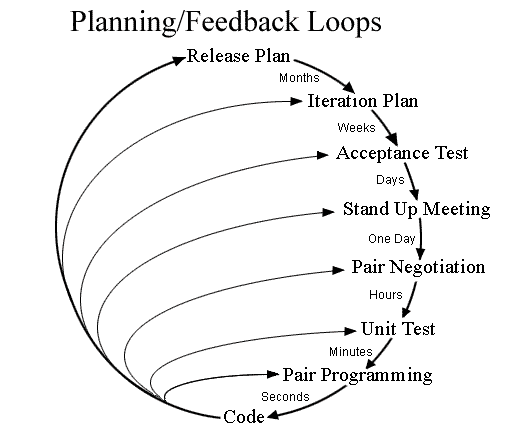

# Agile Methods

Written by: Jeffrey E.G. Derksen  
For course: S-DB-GPS3  
Class: S3-DB01  
Date: 13 April 2022  
Version: 1  

## What is Agile?

Agile within the world of software development defines a set of frameworks and practices that attempt to improve the way software developers can work in an uncertain and turbulent environment. It is based on the Agile Manifesto which defines 12 principles that form the core values of Agile software development. It provides tools that allow developers to self-organize themselves in cross-functional teams.

Key agile concepts are:

- User Stories
- Daily Meetings
- Personas
- Team
- Incremental Development
- Iterative Development
- Milestone Retrospective

## What Agile methods exist?

A large number of Agile software development methods exist. A few notable methods are listed below, with the ones explored in this report highlighted in bold:

- Adaptive software development (ASD)
- Agile modeling
- Agile unified process (AUP)
- Disciplined agile delivery
- Dynamic systems development method (DSDM)
- **Extreme Programming (XP)**
- Feature-driven development (FDD)
- Lean software development
- Lean startup
- **Kanban**
- Rapid application development (RAD)
- **Scrum**
- Scrumban
- Scaled agile framework - SAFe

## Scrum

Scrum is a popular Agile method and the one that I personally have the most experience with, as it is the recommended method within this course. It defines a specific flow of work whereby teams work in time-boxed iterations called *sprints*. These are generally periods of two weeks, sometimes three.

### Scrum process

A Scrum project starts with formulating user stories. Once these have been formulated they are put in a **product backlog** and are assigned a number of *story points*—these represent the expected amount of effort required to complete the user story. At the start of a sprint a **sprint planning** is performed. During this session a number of user stories are selected to be worked on during the sprint and these user stories are then placed in the **sprint backlog**. During the sprint a **daily scrum** (sometimes referred to as a *stand-up*) is held each day at a set time and location. This is a time-boxed session (approximately 15 minutes), facilitated by an appointed *Scrum master/leader*, where team members report on their progress, any problems or issues encountered, and the task(s) they intend to work on during the course of the day. During the course of the sprint work is put into one or more **increments**. These are concrete steps towards the end goal of the project and must be usable, tested and work well together. At the end of a sprint a **sprint review** is held where the completed work gets presented to the stakeholders. This provides an opportunity for the development team to receive feedback, discuss impact of incomplete work and to receive suggestions for upcoming work from the stakeholders. This can also be a good moment to review the user stories in the product backlog and amend, update or re-order them if needed. The last part of a sprint is the **sprint retrospective**. During this session the team reflects on the past sprint(s): what went well and what could be improved in the next sprint. If a large number of points for improvement are found, a selection should be made based on what the team determines are the points with the highest priority. After this step the project is either finished or enters the cycle anew and starts with a new sprint.

  
*Steps of the Scrum process. Source: Scrum.org*

### Extensions to Scrum

There are also several additional techniques that can be used to augment the Scrum process:

- **Burndown chart:** a chart showing the remaining work in a sprint (usually in the form of total story points) against the time available in a sprint. It includes an ideal progress line sloping down from the start of the sprint to the end and the team can use this to help them remain on schedule by updating it each day and comparing actual and predicted progress.
- **Definition of done:** Clear definition for when a user story can be considered finished. May include rules relating to unit/integration/regression testing, security requirements/checks, and requirements for proper documentation and code review.
- **Spike:** a time-boxed period used to research a new concept/technology, create a proof of concept, or a prototype. A spike may or may not produce a tangible outcome. It ends when the time has expired, not necessarily when the objective has been achieved.

### Scrum values

Also part of the Scrum method are a set of five core values: courage, focus, commitment, respect and openness. Commitment to these values by each member of the team is considered important for the successful use of Scrum. Together they help building trust and support the empirical Scrum pillars of transparency, inspection, and adaptation.

  
*The five Scrum values. Source: Scrum.org*

## Extreme Programming

Extreme Programming (XP) is another well-known agile method with a particular focus on: extensive (unit) testing, pair programming, adding functionality only when needed, simplicity, and frequent communication with the customer. The name comes from the idea that practices that are considered beneficial when developing software are taken to an extreme level, such as frequent code review and rigorous testing.

  
*Feedback loops within Extreme Programming. Source: J. Donovan Wells*

When compared to Scrum, Extreme Programming differs in that it prescribes more specific software development practices and techniques and is therefore really only useful for programmers. Scrum's emphasis lies more on project management and is therefore applicable to manage products of different types. Another difference is that Extreme Programming can be implemented in part and/or modified to suit the needs of the team—there is even a rule for that: "Fix XP when it breaks." Incorporating Scrum on the other hand requires your team to fully embrace it in its entirety and without modification, otherwise—at least according to the official Scrum Guide—you are not using Scrum properly.

## Kanban

Kanban, like Scrum, is a project management system designed to improve work across human systems. It places an emphasis on visualizing the workflow in a project. Central to this system is the Kanban board—Kanban being the Japanese word for *signboard*, *billboard*, or *visual signal*—which shows a clear overview of work in all of its stages represented by cards, and work in progress limits for each stage. The overview provides complete transparency within the team—who is working on what, which tasks are available and which tasks are completed. The stage limits make sure that no stage becomes overwhelmed with too many tasks. If a stage has reached its task limit, an existing task has to be completed first before a new one can be put in its place.

  
*Example of a Kanban board. Source: Atlassian*

When compared to Scrum, Kanban differs in its continuous flow of work, whereas with Scrum work is divided into sprints. There are also no roles required within teams working with Kanban. Changes (such as to-do items or estimates on item/user story duration) can also be introduced at any time whereas with Scrum these changes can only be made during a sprint planning.

## Recommendations

After researching several different Agile methods I feel there is no single *best* management method or tool that I could recommend. What I would recommend instead is taking elements from several agile methods. For example, Scrum can provide a good base for project management, but it might prove useful to incorporate features from the Kanban method, such as the board and the work in progress limits. There are also several useful practices that can be employed from Extreme Programming, such as frequent code review (as an alternative to pair programming), testing from an early stage, simplicity / only adding needed features, and frequent communication with the customer.

I believe that, with some experimenting and practice, a number of these elements can be implemented together quite well and which combination works best is likely different for each team and each project.

## Sources

- [Agile Alliance](https://www.agilealliance.org)
- [Agile-Process.org](http://www.agile-process.org)
- [Atlassian - Kanban](https://www.atlassian.com/agile/kanban)
- [Extreme Programming vs. Scrum: What's the Difference?](https://www.coscreen.co/blog/extreme-programming-vs-scrum-difference)
- [Scrum.org](https://www.scrum.org)
- [Wikipedia - Agile software development](https://en.wikipedia.org/wiki/Agile_software_development)
- [Wikipedia - Extreme programming](https://en.wikipedia.org/wiki/Extreme_programming)
- [Wikipedia - Kanban](https://en.wikipedia.org/wiki/Kanban_(development))
- [Wikipedia - Scrum](https://en.wikipedia.org/wiki/Scrum_(software_development))
