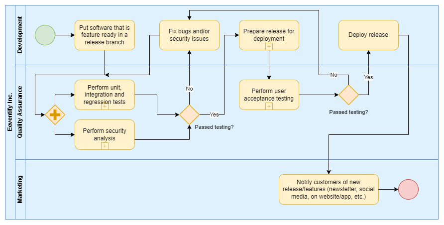
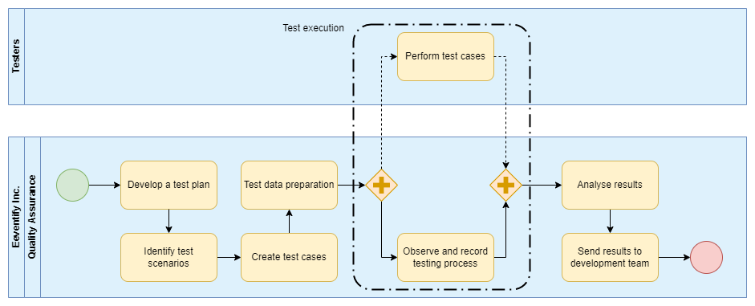

<!-- omit in toc -->
# Business Processes

Written by: Jeffrey E.G. Derksen  
For course: S-DB-GPS3  
Class: S3-DB01  
Date: 22 June 2022  
Version: 1  

<!-- omit in toc -->
## Table of Contents
- [1. What is a business process](#1-what-is-a-business-process)
- [2. The role of software applications in business processes](#2-the-role-of-software-applications-in-business-processes)
- [3. Examples of business processes](#3-examples-of-business-processes)
  - [3.1. Product release process](#31-product-release-process)
  - [3.2. User acceptance testing process](#32-user-acceptance-testing-process)
- [4. Sources](#4-sources)

## 1. What is a business process

A business process can be described as a sequence of activities or tasks designed to create something of value, such as a product or service. They can be implemented on and across all organizational levels and are often modeled as a flowchart or process matrix visualizing the sequence of the steps and their relation to each other. A business process starts with an objective or a goal (often in the form of a customer request or need), and it ends with a product, service, or other result that satisfies this objective or goal.

Business processes come in all shapes and sizes. Large business processes are often comprised of multiple, smaller subprocesses. Most business processes can be organized into one of three types:

- Operational processes: these provide the core business of producing value for the customer; providing a service or manufacturing a product.
- Management processes: these oversee the operational processes; for example: corporate governance, budget management, and employee oversight.
- Supporting processes: these support the operational processes; for example: recruitment, technical support, and accounting.

## 2. The role of software applications in business processes

Modern business processes frequently depend strongly on software and computer systems. They support business processes by helping to automate them or to make them more efficient, faster, and/or require less personnel. Some business processes would not even be possible without software applications. Software applications may be used to enter and retrieve data from database systems, perform analysis or calculations, facilitate cooperation, monitor performance, and keep track of progress and making this information available to all the stakeholders in the process.

Software applications and business processes actually share something akin to a symbiotic relationship. Software applications support business processes, but the reverse is also true. The process of developing, maintaining, and releasing software applications also benefits greatly from properly implemented business processes. The following couple of sections in the report will detail some of the processes that are used when releasing a version of a software application to the public.

## 3. Examples of business processes

Below are two examples of business processes for the development of a software application. They detail business processes that could be implemented for Eeventify, the application that I helped develop for our group project. It is an application that helps people find others who share similar interests to theirs and provides a platform to organize, discover and join events (online *and* in person) that correspond to their interests.

### 3.1. Product release process

When releasing a new version of a software application, it is important that it meets certain standards before it can be deemed ready for deployment. That is where a product release process comes in. It is a good example of an operational process.

Below you can see a product release process as it could be implemented for Eeventify. The stakeholders in this process are the customer and the departments of development, quality assurance, and marketing. The process contains a number of tasks that are necessary to ensure a qualitative, secure, and reliable release. In addition to the regular tasks, the process contains four subprocesses for user acceptance testing, security analysis, preparing release for deployment, and the final quality review. The next section contains a more detailed view of one of them: user acceptance testing.

  
*Product release process for Eeventify.*

The development department starts the process by deciding when the development on new features for the software application has reached a point where it is ready for a new release. The code is then placed on a release branch and no more features are added to it. This is known as the feature freeze. The next step is for the quality assurance department to perform unit, integration, and regression testing and a security analysis. If the release fails either of these steps, the results are sent back to the development team to be fixed.

If the release passes the tests, the development team gets permission to go ahead and prepare the release for deployment. After this task has been accomplished, the deployment build is sent to the quality assurance team for user acceptance testing. If it passes the tests, the development team receives permission to deploy the new version. If not, they have to fix the problems and run their code through initial testing again. The final step in the process is for the marketing department. They are responsible for notifying the users of the application that a new version has been released as well as which new features and fixes it contains.

### 3.2. User acceptance testing process

One of steps in the product release process is verifying that the code passes certain quality requirements before it is released. This can be ascertained by applying user acceptance testing, a comprehensive process that qualifies as a business process on its own.

Below you can see a user acceptance testing process as it could be implemented for Eeventify. The stakeholders in this process are testers and the departments of quality assurance. Indirectly, the department of software development is also involved, as the task of the quality assurance team is to test their release build, and report their findings back to them.

  
*User acceptance testing process for Eeventify.*

The quality assurance department starts the process by developing a test plan which outlines the strategy that will be used to verify if the release meets the business requirements set for the product. It specifies entry and exit criteria, timelines of testing, which end-users will test which part of the application. In addition, it contains the test scenarios and test cases, which will be developed in the next steps of the process. Business use cases can be used as input for defining the test scenarios, and will attempt to cover all the situations that can arise while using the product, as well as the desired outcome. The next step is preparing the test data. It is best to use live data for testing, but it should be scrambled for privacy and security reasons.

After this, the actual testing process can begin. Carefully selected testers—these should be end-users or employees that should think as an unknown user to the system—will be asked to perform the test cases specified in the test plan. It is important that the entire process gets recorded and documented, and that this data gets passed along to the development team along with the results at the end of the process. After the test process is finished, the quality assurance team analyses the results, verifying if the release meets the business requirements. Then they pass their findings and test data on to the development department.

## 4. Sources

- [Comidor: What is Business Process | Business Process Definition](https://www.comidor.com/knowledge-base/business-process-management-kb/business-process-definition/)
- [Guru99: What is User Acceptance Testing (UAT)?](https://www.guru99.com/user-acceptance-testing.html)
- [Lucidchart: 5 Steps to a successful release management process](https://www.lucidchart.com/blog/release-management-process)
- [The Process Consultant: What is a business process?](https://www.youtube.com/watch?v=NXbGIilFidA)
- [The Process Consultant: How IT and Business Processes Fit Together](https://www.youtube.com/watch?v=3iAp9me4P1c)
- [Userback: All You Need to Know About User Acceptance Testing (UAT)](https://www.userback.io/blog/user-acceptance-testing-explained)
- [Visual Paradigm: What is BPMN?](https://www.visual-paradigm.com/guide/bpmn/what-is-bpmn/)
- [Wikipedia: Business process](https://en.wikipedia.org/wiki/Business_process)
