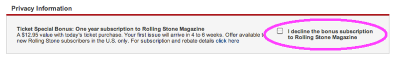
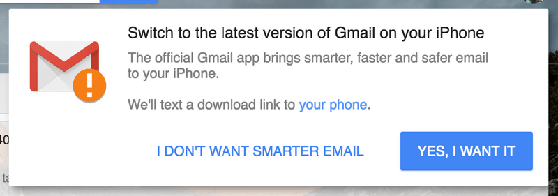
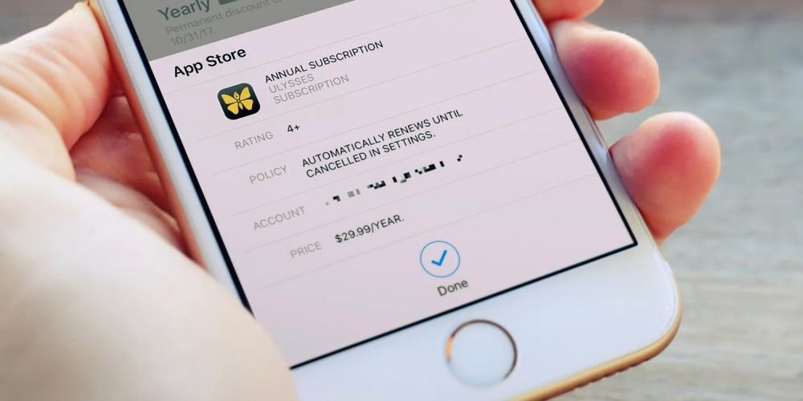
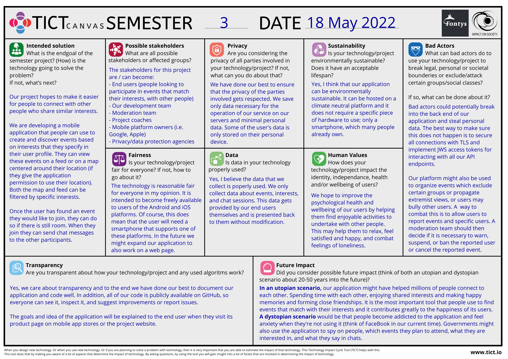
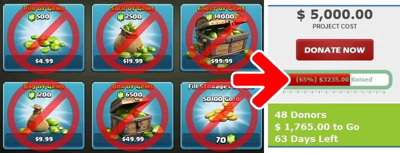

# Ethics Analysis

Written by: Jeffrey E.G. Derksen  
For course: S-DB-GPS3  
Class: S3-DB01  
Date: 18 May 2022  
Version: 1  

## Ethics in software engineering

Ethics are a system of moral principles within a culture or professional field. They can be used to guide our decision making when we want to make honest, fair, respectful, and inclusive choices. In short, they can be used to determine what we feel is the *right* thing to do. In software engineering these apply to the design decisions that are made during the development of software systems.

The following is a list of several well known ethical aspects and best practices within the field of software development:

- Accessibility
- Respecting user privacy
- Ensuring security
- Informing users
- Deliver good quality (testing your software)
- Focus on your user's needs and/or desires
- Give users ownership of their data (preventing vendor/product lock-in)
- Make code public when possible
- Do not incorporate deceptive or addictive design patterns

  
  
*Examples of deceptive design patterns. Source: deceptive.design*

### Why are ethics important in software engineering?

Ethics are important in software engineering because the software that an engineer writes has the potential to be used by large groups of people and might have a significant impact on their lives. As a software engineer you have to be aware and mindful of these possible consequences as you envision, develop and deploy your software. Not all consequences can be foreseen but you *should* feel responsible for attempting to ensure that your software does not cause harmful effects but instead benefits the people who use it.

### What do you have to do as a software engineer to address ethical aspects in your work? 

As a software engineer you need to be aware of the different ethical aspects, principles, and practices within the field. You should ensure that your software meets accessibility standards, that it respects a user's privacy, that it is secure, and all the other aspects as mentioned earlier in this document. In order to achieve this you have to critically evaluate your software design in all stages of its development, starting off with an ethically sound design and adjust it when necessary. Test and review your software frequently to see if it still meets your ethical requirements. Request user feedback and see if their needs are being met, and collaborate with them to improve your software.

### How do you know that your ethical considerations match with those of other software engineers? 

In order to make sure that your ethical considerations match with those of other software engineers like your colleagues, it is advisable to discuss these considerations when starting development of a new software project, as well as when welcoming a new member to the team. Good communication is key, ask your colleagues about their views on the subject and which ethical considerations they find important. It is also a good idea to monitor developments in the field by reading articles (on the internet) and attending conferences about software development.

Furthermore, it might be helpful to create a document containing ethical guidelines and principles for use within your team, or search for one on the internet and adapt it to suit your team and project. Make sure that it is accessible to each member of the team and that they know where to find it. Also plan regular reviews of it to make sure that it is still up to date and reflects the views and values of your team, amending it if needed.

## Ethics analysis for group project

While developing our group project (Eeventify, an application to organize and discover events that match your interests), we as a team have taken into account several of the ethical aspects discussed above. The application is designed and developed to help fulfil the need that a lot of people have to meet with others that have similar interests and organize events where activities related to these interests can be performed. At the moment it is not very easy to discover these things, and people might feel more lonely or unhappy as a result. We hope that our application makes this process easier and leads to happier and more fulfilling lives.

No unnecessary data is collected from our users, and the data that does get collected we have tried to secure to the best of our ability within the time and knowledge constraints. Users are encouraged to choose a strong password when they register and the back end of the application uses JWT access tokens for authentication and authorization purposes.

Our services are regularly and automatically tested, so that we can respond to any disruptions quickly. And a CI/CD pipeline has been established so that new features, bugfixes, and changes to documentation are brought online almost instantly. We hope this contributes to a good quality product for our users. All of our code is publicly available for everyone to inspect, improve, or to suggest ideas for improvement.

### Ethical conflicts

Ethical conflicts for Eeventify may arise from a number of areas. For example, in order for the application to work well, it is recommended that the user gives the application access to their current location and provides their interests. However, this information is considered to be sensitive personal data, and it would therefore be very important to handle this information carefully and securely so as not to compromise the privacy of our users.

Another conflict might arise when some users choose to (ab)use our platform to threaten the security and wellbeing of other people. This could be in the form of bullying, exclusion, or discrimination. Users may also use the platform to organize events that could result in harmful consequences, such as those centering around extremist views or with an intend to inflict damage to property or people.

Another area of potential conflict is financing. The application needs infrastructure to run on, and staff to maintain and improve it. These are expenses that have to be compensated for by some kind of income. We would like to make the application freely available to everyone. This means that we must search for an alternate source of income besides simply making the user pay for the application up front or using a subscription model. The method that we choose should have a minimal negative impact on ethical aspects such as privacy or user needs and desires.

### Conflict solutions

In order to protect the privacy of our users, we do not keep track of their location data. It is sent to our servers when viewing the map overview to determine which events are nearby the user, but we do not store this information. User interests do get stored in our databases, and we feel this is necessary because it is important to the operation of our application (displaying events with matching interests) and if we were to store it locally on a user's device, the information would be lost if a user loses, changes, or resets their device. We keep the stored information as secure as possible and we do not use it for any unrelated purposes or sell it to third parties.

A solution to users abusing our platform to cause harm to other people could be the formation of a moderation team that monitors events, responds to complaints, and deals with events and users that have been reported by users of the application. This should be used in conjunction with a terms of agreement document that users have to accept before using the application, wherein desirable and forbidden practices and behavior are defined.

Financing the application could be done by employing advertisements within our application that respect our users' privacy. This means no tracking and no personalization of the advertisements. Furthermore, it might be an option to introduce a "premium" subscription for our users. Users with this subscription would not get to see any advertisements and would be directly supporting the continued existence of the application.

  
*One of the options for generating income: a premium subscription. Source: 9to5mac*

### TICTCanvas

## Ethics analysis for individual project

While developing my individual project (CollectiCats, a game about collecting, trading, and breeding virtual cats), I have paid attention to and based my decisions on the ethical aspects that I have mentioned earlier in this document. All but one of them are applicable to my project. The only one which I feel is not relevant for CollectiCats is giving players ownership of their data. The data that I store about players is unique to this particular game and I don't see any benefit for my users if they can export that data.

Aspects that I have paid particular attention to are: privacy and security, focusing on my user's needs and desires, and making my code publicly available and well documented. And of course I do not incorporate any deceptive or addictive design patterns.

To ensure player privacy and security, I collect as little personal data about my users as possible. Players can register and login through an external service (Auth0), which should ensure a very high level of security as well as giving the user the option to log in with an external account such as a Google account. This limits the amount of personal information that I have to and am able to store.

### Ethical conflicts

One possible ethical conflict could arise from my desire to make the game fun and engaging. This could possibly lead to some players getting addicted to playing it. This is a concern for almost any game out there, and it is a careful balance to maintain for the designers of a game.

And there is also the matter of financing the infrastructure costs that are required to keep the game available on the internet. Many (web based) games generate income through advertisements, subscriptions and/or microtransactions. This conflicts with the interests of the player because advertisements might collect personal data, subscriptions cost the player money each month and might go unnoticed after a while, and microtransactions often rely on deceptive and addictive design patterns in order to be effective.

### Conflict solutions

To minimize to chance of players getting addicted to playing the game, I plan to implement systems that encourages the player to take a break every now and then. This could be done by monitoring if a player spends large amounts of time on the website or if they visit it very often on a single day. Of course when doing this it is important to pay attention to player privacy, so hopefully this system can be implemented without storing any of this data on the servers, and preferably not even on the player's computer. Another way it can be implemented is by showing the player a message randomly, perhaps as part of a series of gameplay tips.

In order to finance the infrastructure costs I have planned to rely on player donations. I don't want players to *have* to pay in order to play the game, and that includes paying with their personal data in the form of advertisements. The idea is to be totally transparent, displaying the costs and the total of collected donations. This way players can donate if they like the game and want it to continue to be available, and only if they can afford to do so. The game will also definitely not include any microtransactions that players could use to skip timers or acquire rare items, cats, or loot boxes.

  
*No microtransactions! Donate instead. Source: Clash of Clans & rewarding-fundraising-ideas.com (edited)*
