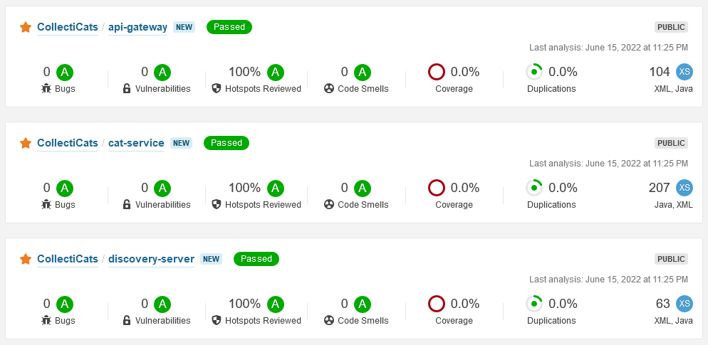
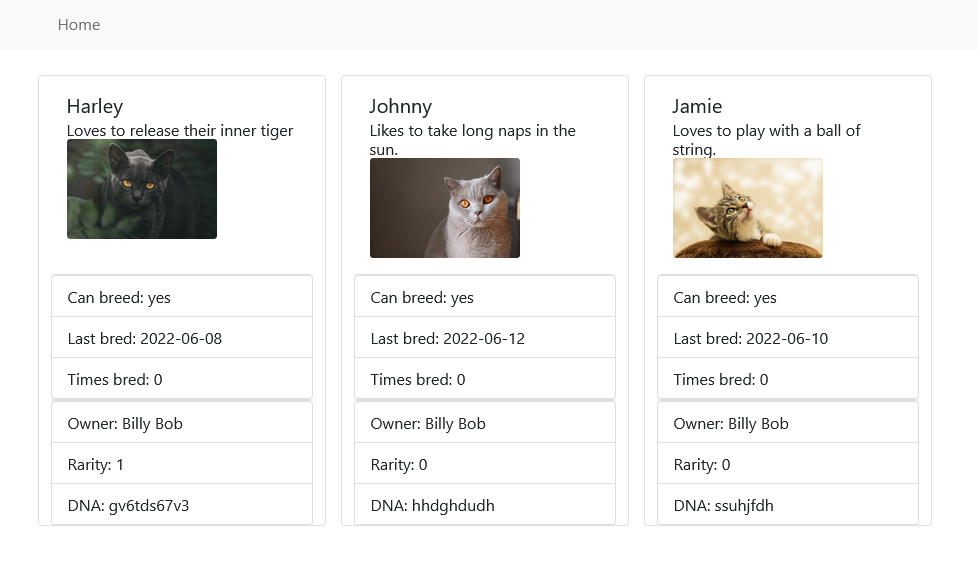

<!-- omit in toc -->
# Research report: Optimizing for outsourcing

Written by: Jeffrey E.G. Derksen  
For course: S-DB-GPS3  
Class: S3-DB01  
Date: 17 June 2022  
Version: 1  

<!-- omit in toc -->
## Table of Contents
- [1. Introduction and main research question](#1-introduction-and-main-research-question)
- [2. Sub-questions](#2-sub-questions)
- [3. Best practices and design patterns for outsourcing your software project](#3-best-practices-and-design-patterns-for-outsourcing-your-software-project)
  - [3.1. Use a style guide](#31-use-a-style-guide)
  - [3.2. Provide clear requirements](#32-provide-clear-requirements)
  - [3.3. Provide comprehensive documentation](#33-provide-comprehensive-documentation)
- [4. Implementing best practices and design patterns](#4-implementing-best-practices-and-design-patterns)
  - [4.1. Task description](#41-task-description)
  - [4.2. Documentation](#42-documentation)
  - [4.3. Static Code Analysis](#43-static-code-analysis)
- [5. Outsourcing experiment](#5-outsourcing-experiment)
  - [5.1. Received feedback](#51-received-feedback)
- [6. Conclusion](#6-conclusion)
- [7. Sources](#7-sources)

## 1. Introduction and main research question

In the field of software engineering, a developer seldom works on a project alone. When you develop a large application or other comprehensive software project, you most commonly work in a team. And software projects or components may very well be used by outside developers to incorporate into their project as a dependency. In these situations it is very important that the code that you write is clear and logically structured according to established style guidelines, and that you provide useful and detailed documentation alongside your code. When this is properly executed, a team member or even a developer from the other side of the world with no prior knowledge of your project can easily utilize, customize, and expand your code. In this research report, I will seek to find answers to the following **main research question:**

> How can you, as a software developer, best prepare and optimize your code/application for seamless outsourcing?

This research project has been performed partly as a joint research with a fellow student, [Robin van Hoof](https://github.com/RobinvHoof). We chose the same topic and have agreed to participate as a test subject in each others research project by building a front end proof of concept application for a back end application we have developed ourselves. Afterwards we provided feedback on the process. Was the code and documentation clear and straightforward, did we get stuck during development and had to contact the other for help and/or clarification, etc.

During this research project I have made use of the [DOT framework](https://ictresearchmethods.nl/The_DOT_Framework) to guide my process and to assist me with acquiring the right information and drawing conclusions from it. I have made use of the following methods:
- Library: best good and bad practices, design pattern research, literature study
- Field: survey
- Showroom: peer review, static program analysis

## 2. Sub-questions

In order to answer the main research question, I have broken the problem down into smaller sub-questions:

- Wat are some best practices and design patterns for outsourcing your software project?
- How to implement these practices into my own software project?
- Is another developer able to utilize my software as part of a new product without requiring my assistance?
- Are there points for further improvement?

I will try to find answers for each of these questions in the following chapters of this report.

## 3. Best practices and design patterns for outsourcing your software project

I have found several best practices and design patterns that should improve the suitability for outsourcing of your software project. The following are the ones that I believe are most important: software quality and style, clear requirements, and comprehensive documentation.

### 3.1. Use a style guide

When developing your code it is recommended to write your code according to the established style guidelines for the programming language that you are using. This helps make your code well structured and easily understandable by other developers who also follow those same style guidelines, in other words it improves your software quality. I have looked up the [Java Style Guide by Google](https://google.github.io/styleguide/javaguide.html) and checked my code to see if it complies with the style guidelines, adjusting it where necessary.

### 3.2. Provide clear requirements

It is important to provide a clear task description and list of requirements to the outsourcing party, so that they know what you expect to receive from them. If this is not provided, or only agreed on orally, this might lead to misunderstandings and disappointments later on when (progress on) the product is reviewed or delivered.

### 3.3. Provide comprehensive documentation

Your code needs to be well documented so that outside developers can quickly get up to speed or look up specific information about your application. In this specific case, when a front end application needs to be developed for a back end application providing API endpoints, clear documentation about the API endpoints is needed so that the right fetch methods can be written in the front end and so that the structure of the API responses is well known.

Apart from the API documentation, you might also provide documentation for setting up your application locally or self-hosting. This can be done by including it in the README file on your repository page, so that it is conveniently located right next to your code.

## 4. Implementing best practices and design patterns

With the information I have discovered in the previous step, I have worked on implementing these practices and design patterns into my application to prepare it for outsourcing to another developer. For this purpose I have written a task description, written and generated documentation, and applied static code analysis to my project.

### 4.1. Task description

I've written a task description for Robin, so that it is clear to him what I expect him to produce during this outsourcing experiment. Besides a short description about the task, I have included a list of functionality that the proof of concept should be able to provide.

> CollectiCats Front End Proof of Concept
> 
> Task description: Please develop a front end proof of concept for the CollectiCats application capable of providing the functionality listed below. The back end repository should contain all the documentation you need to get started. You're free to choose which technologies you use to develop the proof of concept, as long as it is able to communicate through REST API calls with the back end application.
> 
> The proof of concept should be able to provide the following functionality:
> - Connect to the CollectiCats back end through REST API calls
> - Fetch all Cats from the back end and display them on your front end webpage

### 4.2. Documentation

I have set up two kinds of documentation for the back end of my application. One details setting up the application by using Docker Compose, and the other contains information about the API endpoints that the back end provides, such as: routes, parameters and response bodies. I have included the documentation about setting up the back end together with the code itself on a [GitHub repository](https://github.com/jeffrey-fontys/collecticats). And the documentation about the API endpoints is available through Swagger UI when you run the back end application.

  
*CollectiCats Swagger API Documentation.*

### 4.3. Static Code Analysis

To further monitor and improve my code quality, I have implemented static code analysis into the continuous integration process for my application. This was suggested on both Canvas and in the DOT framework method static program analysis. The software I have chosen for this is SonarCloud. This platform offers easy integration with GitHub and checks for a plethora of possible quality issues, such as: bugs, vulnerabilities, code smells, test coverage, and duplication of code.

  
*Overview of static code analysis for some of my project's services in SonarCloud.*

## 5. Outsourcing experiment

To test the effect of the measures taken to improve the quality and documentation of my code, I offered my application code, documentation, and task description to my fellow student and test subject, Robin. After the experiment concluded and Robin finished his proof of concept, I asked him for feedback and requested that he fill in a short survey that I prepared about the quality of my documentation. These methods correspond with the DOT framework methods of peer review and survey.

  
*Proof of concept for CollectiCats made by Robin.*

### 5.1. Received feedback

Robin found my documentation relatively easy to find and accessible, written in clear and easy to understand language, and pretty complete. He did feel that there was room for improvement in its logical structure. And he felt that detailed descriptions for the endpoints in the API documentation were missing.

He did not get stuck at any point however, and did not have to contact me because something was so unclear that he could not proceed. He was also able to develop the proof of concept, which provides all the required functionality, in a relatively short time of only 1½ hours.

A PDF version of the survey form with Robin's answers can be found [here](../images/Survey%20-%20Quality%20of%20Documentation.pdf).

## 6. Conclusion

Guided by the sub-questions that I have formulated at the start of this research project and by making use of several methods from the DOT framework, I have found best practices and design patterns, implemented these insights into my project, and performed an experiment to determine the effectiveness of these implementations. And so I can finally attempt to provide an answer to the main question formulated for this research project: "How can you, as a software developer, best prepare and optimize your code/application for seamless outsourcing?"

The answers that I have found suggest that proper and comprehensive documentation, task descriptions, and requirements are some of the most effective ways to increase the chances that an outsourcing project will go smoothly and yield the desired results. After implementing all these elements into my own project and then performing an experiment to observe their effectiveness, I am quite satisfied with the result. There is still room for improvement though, as I have found out from the feedback I received after the experiment. The next time I will make sure that my documentation is even more detailed.

## 7. Sources

- [Canvas: Research Reports](https://fhict.instructure.com/courses/12078/pages/research-reports-bachelor-students-only?module_item_id=749929)
- [Canvas: Code Quality Analysis](https://fhict.instructure.com/courses/12078/pages/code-quality-analysis?module_item_id=749946)
- [DOT framework](https://ictresearchmethods.nl/The_DOT_Framework)
- [Java Style Guide by Google](https://google.github.io/styleguide/javaguide.html)
- [Microservices API Documentation with Springdoc OpenAPI](https://piotrminkowski.com/2020/02/20/microservices-api-documentation-with-springdoc-openapi/)
- [Outsourcing Strategy – A Focus on Best Practices](https://www.pcg-services.com/outsourcing-strategy-focus-best-practices/)
- [What Is Software Development Outsourcing (Pros, Cons & More)](https://biz30.timedoctor.com/outsourcing-software-development/)
